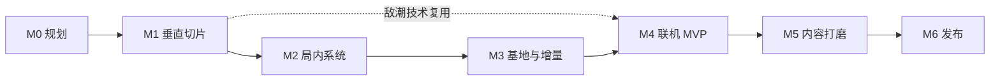

# 开发路线图

> 版本：v0.1（规划稿）  
> 日期：2026-08-09  
> 假设：2-4 人小团队（1-2 程序 + 1 策划/程序 + 1 美术/外包）；工期为估算，可按团队规模调整

## 0. 总览

开发顺序的核心原则：**先把「割草 FPS 手感 + 千人敌潮」这条最冒险的线打通，再补系统，再接联机，最后做内容与打磨。** 每一个里程碑结束都有可玩版本，不建空中楼阁。

| 里程碑 | 主题 | 估算 | 状态 |
|---|---|---|---|
| M0 | 规划与工程上下文 | 0.5-1 周 | 进行中（本文档集） |
| M1 | 单机垂直切片 | 4-6 周 | 未开始 |
| M2 | 局内系统完整 | 6-8 周 | 未开始 |
| M3 | 基地与增量系统 | 6-8 周 | 未开始 |
| M4 | 联机 MVP | 6-8 周 | 未开始 |
| M5 | 内容、平衡与打磨 | 8-12 周 | 未开始 |
| M6 | 发布准备 | 4-6 周 | 未开始 |

合计约 35-50 周（小团队全职），即 9-12 个月。

## 1. M0：规划与工程上下文（进行中）

**交付物**

- 参考调研（已完成）
- GDD（已完成）
- TDD 技术方案（已完成）
- 联机方案（已完成）
- ADR 决策记录（已完成）
- `.agents/ue-project-context.md`（已完成初稿）

**门禁（Gate）**

- 设计方向、范围与关键技术决策经用户确认。
- 确认工作名、平台、首发范围（不做内容）。

## 2. M1：单机垂直切片（最高优先）

**目标**：证明「FPS 手感 + 千人敌潮 + 悬赏节奏」三条核心假设成立。

**范围**

- FPS 角色：移动、跳跃、冲刺、开火、换弹、近战魔剑（使用模板项目基础重构）。
- 武器：魔剑、魔弓、法杖（3 种，Tier 1 可用，数据驱动）。
- 弹药经济：近战回魔力、弓手掉箭（简化敌人：见习剑士、流浪弓手、狮鹫骑士）。
- 敌潮：Mass Entity + 2D 纸片精灵，单机 3000 实体；空间哈希命中；Flow Field 移动。
- 悬赏榜：悬赏等级 1-3、追加悬赏、狂潮翻倍、掉落倍率。
- 局内升级：经验、升级 3 选 1（5-8 个基础 Perk）。
- 单一地图「魔王城」原型：魔王殿 + 简易城墙 + 2 个入口。
- 结算：金币/魔核 → 简易存档 → 重启增强（先做 2-3 项永久升级验证增量循环）。
- 性能基线：标准波次配方 + Unreal Insights 记录。

**明确不做**：建造系统、魔王军、联机、BOSS 完整机制、UI 打磨。

**验收标准**

- 10 分钟完整悬赏：开局 → 发布悬赏 → 高压 → 结算。
- GTX 1050 级机器 3000 敌人 60 FPS（低画质）/30 FPS（最低档）。
- 射击手感内部试玩获得「愿意再来一局」的结论。
- 死亡不丢收益，重启后明显变强。

**任务拆分（示例）**

1. 重构模板角色为魔王（移动/武器挂点/相机）。
2. 武器 DataAsset 框架 + 3 武器实现。
3. Mass 敌潮：实体、Processor、生成器、2D 精灵实例化。
4. 空间哈希命中 + 伤害/死亡事件。
5. 悬赏榜与狂潮状态机。
6. 局内 XP/Perk 数据驱动。
7. 简易结算与存档。
8. 性能调优与基线记录。

## 3. M2：局内系统完整

**目标**：把「一夜」做成完整、有构筑深度、有 Boss 战的产品级循环。

**范围**

- 武器：补齐 10 种原型；Tier 1-5 + 形态变化；3 附魔插槽与 Mod 掉落。
- Perk：40+（兵刃/体魄/掠夺/城防/悬赏五系）；主动技能 6+。
- 敌人：补齐勇者潮 14 种；精英光环；3 个 BOSS 完整机制（全 2D）。
- 传说勇者事件：BOSS 触发、主动追加悬赏召唤、胜利/失败结算分支。
- 掉落：金币堆/补给箱/魔核/图纸碎片；掉落池与拾取（非逐怪 Actor）。
- 数值曲线：悬赏等级、转生深度基线、武器 Tier 曲线。
- 局内 UI：HUD、升级选择、悬赏槽、BOSS 血条。

**验收标准**

- 一场 20-30 分钟悬赏有明确的三幕节奏（清潮 → 构筑成型 → 传说勇者）。
- 三种不同构筑（魔弓爆头流/魔剑近战流/渊火 AOE 流）可通关同一难度。
- BOSS 战不掉帧（敌潮降载机制生效）。

## 4. M3：基地与增量系统

**目标**：把「基地是第二把武器」和「每次死亡都有意义」做成完整闭环。

**范围**

- 地块系统 + 10 个设施 + 局内临时防御（墙/炮塔/陷阱）。
- 魔王军：3 兵种、上限、驻守/指挥（魔池）。
- 5 位城民 NPC 与各自功能（锻造/附魔/魔池/商人/炼金）。
- 三资源 + 图纸 + 转生头衔 + 转生深度 1-10。
- 世界存档与玩家档案（版本化、迁移）。
- 基地 UI：建造模式、设施面板、结算对比。
- 三张夜晚主题地图（复用基地场景切换）。

**验收标准**

- 完整局外循环：结算 → 回基地 → 至少 3 个明确升级目标 → 下一夜变强。
- 建造有策略价值：纯站桩 vs 合理布防的胜率差异明显。
- 存档跨版本迁移有自动化测试。
- 转生深度 5+ 提供新敌人/BOSS 变体，而非纯数值。

## 5. M4：联机 MVP

**目标**：4 人合作完整跑通「同一夜、同一基地」。

**范围**

- Listen Server + Steam 会话/邀请。
- 权威模型：移动/射击/建造/结算全部服务器权威。
- 敌潮批次快照 + 客户端同构重建 + 事件流（核心风险项）。
- 共享 GameState：悬赏、预算、城防耐久、阶段。
- 魔王名号初版：剑渊魔王/焰狱魔王/永夜魔女/冥渊魔王（可后置到 M5，若时间紧）。
- 双档案同步：玩家档案上传/校验、世界档案下发。
- 掉线重连（60 秒）、房主掉线提示与结算保护。
- PIE 多进程 + 真实 Steam 邀请测试。

**验收标准**

- 4 人真实联机 60 FPS（客户端），服务器帧率 ≥ 30Hz。
- RTT 200ms 模拟下命中体感可接受。
- 中途加入仅基地阶段；掉线 60 秒内可重连并恢复个人状态。
- 无「打怪不死/掉线丢进度」的明显反噬。

## 6. M5：内容、平衡与打磨

**目标**：从「能玩」到「好玩、好看、好卖」。

**范围**

- 内容补全：地图 3 张、武器/Perk/敌人最终数量、BOSS 变体、转生深度 10 级内容。
- 平衡：增量曲线、难度曲线、联机人数缩放；组织封测收集数据。
- 表现：魔力/命中/尸体特效、屏幕震动、音效逐武器打磨、悬赏与战鼓音频。
- UI/UX：全部菜单、设置、结算、建造、教学（新手 5 分钟上手）。
- 本地化：简中/繁中/英文。
- 性能：全内容场景压力测试、内存/加载时间优化。
- 可及性：灵敏度、色弱、震动、字幕。

**验收标准**

- 新玩家 5 分钟理解核心循环，10 分钟产生「再来一局」。
- 全内容 60 FPS；最低配 30 FPS。
- 三种语言无截断/无缺字。
- 封测留存数据达到预设基线（见 GDD 第 12 节）。

## 7. M6：发布准备

**目标**：上线 Steam。

**范围**

- 联机加固：房主迁移或专用服务器（二者选一，优先房主迁移评估）。
- EOS/Steam 线上环境、云存档评估、反作弊范围校验上线。
- 商店页、宣传片、Demo 版本。
- 封测 → 公开测试 → 正式发布。
- 发布后计划：热修流程、数据埋点、赛季/内容更新通道。

**验收标准**

- 连续 72 小时 soak test 无崩溃/存档损坏。
- 联机成功率（建房/加入/重连）≥ 95%。
- 崩溃率 ≤ 1%；首日/首周补丁计划就绪。

## 8. 依赖关系

注意：M4 的「敌潮批次快照」在 M1 后就应启动技术预研（可与 M2/M3 并行），避免联机里程碑被单点阻塞。

## 9. 风险登记

| 风险 | 等级 | 出现阶段 | 缓解 |
|---|---|---|---|
| 千人敌潮性能不达标 | 高 | M1 | M1 第一优先验证；降级目标明确（数量/画质档位） |
| 2D 纸片角色可读性/动画成本 | 中 | M1 | M1 用 2-3 种敌人验证描边/剪影/方向帧；必要时精英/BOSS 提高帧数 |
| 联机敌潮同步做不出来 | 高 | M4 | M1 后并行预研；备选方案已记录（见联机文档 4.5） |
| 增量数值失控 | 中 | M2-M3 | 数值自动化测试 + 封测数据 |
| 内容量超预算 | 中 | M5 | GDD 内容规模表为硬上限；未达效果先减量不延期 |
| 单人小团队并行度低 | 中 | 全程 | 里程碑拆小、每周可玩版本、外包美术/音频 |
| 房主掉线体验差 | 中 | M4/M6 | 60 秒结算保护先上线；房主迁移按优先级排期 |

## 10. 每阶段必须问的三个问题

1. 这一阶段的可玩版本是什么？谁能在 5 分钟内体验到核心乐趣？
2. 下一阶段最大的技术/设计风险是什么？现在能不能先花 1-2 天做探针？
3. 哪些内容可以做减法？减掉它不影响核心支柱吗？
