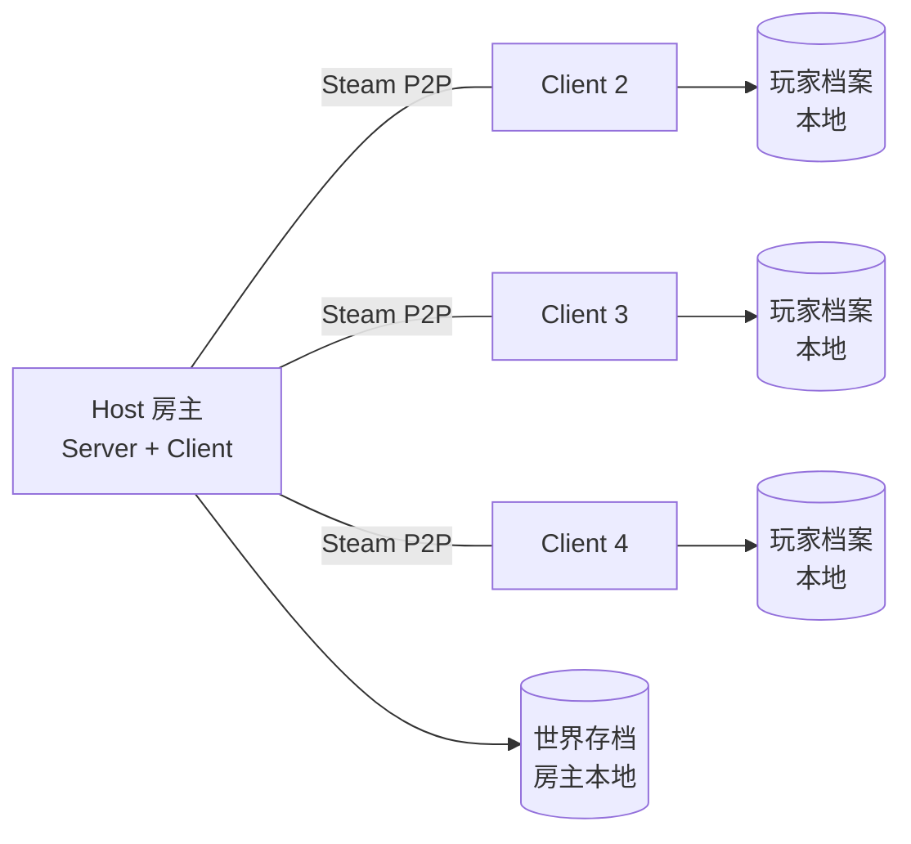

# 联机方案设计

> 版本：v0.1（规划稿）  
> 日期：2026-08-09  
> 文档性质：未来方案，当前 M1 暂不实现联机。  
> 关联文档：[02-游戏设计文档](../02-游戏设计文档.md) 第 8 节、[03-技术设计文档](../03-技术设计文档.md)

## 1. 目标与范围

### 1.1 目标

- 1-4 人 PvE 合作：共享同一座魔王城与同一场悬赏，共同抵御按人数缩放的勇者潮。
- 叙事身份：所有玩家都是魔王，各有名号（剑渊魔王/焰狱魔王/永夜魔女/冥渊魔王），身份对等；房主只是技术上的 Host，不代表身份层级。
- 提供流畅的 FPS 体验：移动/射击客户端预测、服务器权威结算。
- 单机与联机共用同一成长档案，随时可以单人开房或加入好友。
- 中途可加入（基地阶段）、掉线可重连（MVP 限制见 7.2）。

### 1.2 明确不做（首发）

- 不做 PvP、排名、观战模式。
- 不做跨区匹配（仅好友邀请 + 房间列表 MVP）。
- 不做移动端/主机联机（PC 首发；架构预留 EOS 跨平台接口）。
- 不做超大规模（>4 人）同图。

## 2. 拓扑与托管

### 2.1 决策

**MVP：Listen Server（房主主机，房主也是玩家），Steam P2P 传输。**

理由：

- 开发成本低，无需部署服务器；
- 4 人规模下 Listen Server 性能可接受；
- 单人模式与联机使用同一套服务器权威代码，天然一致。

**发布前评估：Dedicated Server（专用服务器）**

理由：

- 房主掉线不终结整局；
- 长时间挂机/稳定托管；
- 未来支持房间列表与跨区。

### 2.2 拓扑图



### 2.3 会话服务

- 首发：OnlineSubsystem Steam（好友邀请、房间 Session）。
- 预留：EOS 接口层（`IOnlineService`），未来切换/双端兼容。
- 房间参数：人数上限（2/3/4）、转生深度、悬赏主题、是否允许中途加入、建造权限。

## 3. 权威模型与网络时间

### 3.1 权威边界

| 系统 | 权威方 | 客户端表现 |
|---|---|---|
| 角色移动 | 服务器（CharacterMovementComponent 标准） | 客户端预测 + 服务器回正 |
| 射击命中/伤害 | 服务器（射线/投射物结算） | 客户端表现射线 + 命中特效预测 |
| 弹药消耗 | 服务器 | 客户端本地显示，服务器校正 |
| 掉落/货币 | 服务器（事件流） | 客户端播放拾取表现，数量以服务器为准 |
| 建造/拆除 | 服务器（合法性 + 预算校验） | 客户端预览网格，确认后播放 |
| 悬赏/狂潮 | 服务器 | 客户端播放发布悬赏动画/音效，状态随 GameState |
| 敌潮生成/死亡 | 服务器 | 客户端通过快照/事件流重建（见第 4 节） |
| BOSS/精英 | 服务器 | 完整复制（Actor/RepNotify） |

### 3.2 延迟补偿

- MVP：不做完整服务器回溯（Server Rewind）。采用：
  - 客户端开火时，本地立即播放命中表现（不阻塞）；
  - 服务器以「收到 RPC 时目标位置 + 容差球（如半径 60cm）」判定；
  - RTT ≤ 200ms 时体感可接受；超出时服务器仍结算但不偏向客户端。
- 若 M4 联机测试中「近距离对射/命中丢失感」明显，再实现基于命中点时间的 100ms 回溯（见 ADR-008）。

### 3.3 频率预算

| 通道 | 频率 | 说明 |
|---|---|---|
| 角色移动复制 | 30-60 Hz（按距离降频） | 标准 CMC |
| GameState 状态 | 5-10 Hz + 事件驱动 | 悬赏、魔核、预算、阶段 |
| 敌潮批次快照 | 10-20 Hz | 见 4.3 |
| 事件流 | 按需批处理，≤ 20 批/秒 | 击杀/掉落/伤害数字 |
| 建筑复制 | 事件驱动 | 建造/拆除/耐久变化 |

## 4. 海量敌群同步（核心方案）

### 4.1 问题

单机目标 3000+ 敌人。若每个敌人都作为复制 Actor 或复制 Mass 实体，带宽与服务器压力完全不可行（数千 × 位置/状态/健康值）。

### 4.2 方案：服务器权威 + 批次快照 + 客户端同构重建

四层结构：

1. **服务器层（权威）**
   - 服务器用 Mass Entity 模拟全部敌人（行为、血量、伤害）。
   - 服务器不逐实体复制，而是周期生成「批次快照」。

2. **快照层（传输）**
   - 快照以空间网格（如 32×32m 单元）聚合：每单元只传「类型 + 数量 + 单元质心 + 单元聚合血量百分比 + 状态位（冲锋/死亡/精英标记）」。
   - 快照只描述「宏观分布」，不描述个体 ID。

3. **客户端重建层（表现）**
   - 客户端使用与服务器一致的波次配方与随机种子，在自己本地跑一份 Mass 模拟（只做视觉/轻量行为，不结算伤害）。
   - 本地模拟以快照为约束：单元内个体位置向快照质心/分布收敛；数量差通过补生/删除表现实体解决。
   - 关键个体（玩家瞄准目标）由客户端从本地模拟中「就近绑定」表现实体，瞄准反馈即时。

4. **事件流层（结果确认）**
   - 服务器把「击杀、精英死亡、掉落簇、伤害数字、基地受击」批量发给客户端（合并为小 RPC）。
   - 客户端用事件流修正本地表现（该死的死、该掉的掉），并播放精准反馈。

### 4.3 带宽估算（4 人时）

假设：60 个网格单元、每单元 1-8 条记录、每条 6-10 字节、10-20 Hz：

| 项目 | 估算 |
|---|---|
| 快照体量 | 60 单元 × 平均 4 条 × 8 B × 15 Hz ≈ 29 KB/s |
| 事件流 | 击杀/掉落合并 ≈ 5-15 KB/s |
| 角色/世界复制 | ≈ 10-20 KB/s |
| 合计/客户端 | 约 40-65 KB/s（远低于宽带限制） |

### 4.4 一致性保证

- 快照是「方向性正确」而非逐实体精确：客户端视觉个体可能与服务器实体错位 ≤ 1 格内，玩家可感知为「一大群」，个体差异在混战中不可辨。
- 玩家明确瞄准的个体（准星悬停 > 阈值）会被服务器标记为「注目实体」并单独下发该实体精确状态，保证重点交互准确。
- 死亡事件按批修正，避免「打中了却还活着」的观感问题。

### 4.5 备选方案与不采用理由

| 方案 | 结论 | 理由 |
|---|---|---|
| 全量复制每个敌人 | 不采用 | 数千实体 × 状态，带宽/CPU 不可行 |
| 纯确定性同步（Lockstep） | 不采用 | FPS 延迟敏感，命中体验差 |
| 客户端全权模拟敌潮 | 不采用 | 无法保证共享伤害/掉落/基地受击的一致性，反作弊差 |
| 混合方案（本方案） | 采用 | 平衡带宽、一致性、FPS 手感与实现成本 |

## 5. 共享世界与基地

### 5.1 共享状态（GameState 复制）

- 夜间阶段、倒计时、悬赏等级、狂潮状态。
- 共享建造预算、城防耐久、魔王军总量。
- 魔核能量与最近发布悬赏者（表现用途）。

### 5.2 建造

- 客户端进入建造模式 → 本地预览（合法性由本地可预测规则给出提示）→ 放置 RPC → 服务器校验地块、预算、权限 → 广播生成。
- 拆除同理；权限规则（默认全员可建，房主可改）服务器强制。
- 临时防御（局内）与永久设施（局外）分开存储；局外设施只在基地阶段编辑。

### 5.3 BOSS/精英

- BOSS 与精英使用常规 Actor 复制（Reliable + 事件），不进入批次快照。
- 玩家对 BOSS 的伤害走标准武器 RPC/复制，保证逐发准确。

## 6. 进度与存档同步

### 6.1 双档案模型

| 档案 | 存储 | 同步方式 |
|---|---|---|
| 玩家档案（Meta） | 每个玩家本地 | 建房时上传摘要（转生头衔/转生深度/已解锁）给服务器校验；结算后写回本地 |
| 世界档案（基地） | 房主本地 | 加入时下发基地视图（设施等级、布局、魔王军上限）给客户端 |

### 6.2 局内结算

- 个人部分（金币、经验、图纸）归各自玩家，随玩家档案。
- 共享部分（基地收益、资源）归房主世界档案；队友的贡献记入玩家档案统计（击杀/助攻）。
- 防重复结算：结算由服务器发起，客户端只能请求，不能写入。

### 6.3 反作弊（PvE 分级）

- 服务器校验：伤害数值、掉落、建造费用、档案范围（不能凭空出现冥银）。
- 客户端信任边界：本地只负责表现与预测；数值一律服务器确认。
- 不做内核级反作弊（合作 PvE 性价比低）；Steam 封禁与 EOS 云存档为发布期选项。

## 7. 会话生命周期

### 7.1 流程

```
主菜单
 ├─ 单人：创建本地会话（无联机开销）→ 基地 → 夜晚
 └─ 多人：
      ├─ 创建房间（难度/人数/权限）→ 大厅等待 → 开始
      └─ 加入：好友邀请 / 房间列表（MVP：邀请为主）
           → 加载基地 → 进入大厅/准备中
           → 开夜（全员就绪或房主强制开始）
           → 夜晚战斗 → 结算 → 回基地 → 下一夜
```

### 7.2 中途加入与掉线

| 场景 | 行为 |
|---|---|
| 基地阶段加入 | 允许；加入者带自己的魔王名号与武器进度（局外档案） |
| 夜晚中途加入 | MVP 不允许；进入排队，夜结后自动加入（M5 可放宽） |
| 玩家掉线 | 保留局内数据 60 秒重连窗口；超时则结算时按当前状态入账 |
| 房主掉线 | MVP：整局结束并提示，未结算收益按当前状态入账；M6 前完成房主迁移或转专用服务器 |
| 全员失败 | 按「当夜已获得」结算，不惩罚 |

## 8. 联机 UI 与体验

- 主菜单区分「单人」与「多人」，多人入口说明人数与难度。
- 大厅：显示玩家的魔王名号、武器选择、转生深度、建造权限开关。
- 房内语音：默认关闭，聊天快捷键提示；MVP 不内置语音（Steam 语音可选接入）。
- 网络状态指示：延迟/丢包图标（仅提示，不打扰）。
- 断线重连：显示「正在重连」覆盖层，60 秒倒计时。

## 9. 性能指标与验收

| 指标 | 目标 |
|---|---|
| 可玩延迟 | RTT ≤ 200ms 无体感异常；≤ 100ms 顺畅 |
| 丢包 | ≤ 3% 目标；5% 下不产生明显幽灵命中 |
| 敌潮视觉 | 4 人时客户端 1500+ 表现实体 60 FPS |
| 服务器负载 | 4 人 + 3000 实体时服务器帧率 ≥ 30Hz（Listen Host 上） |
| 快照带宽 | ≤ 65 KB/s/客户端 |
| 重连 | 60 秒窗口内成功恢复个人局内状态 |

## 10. 风险与缓解

| 风险 | 影响 | 缓解 |
|---|---|---|
| 批次快照视觉不一致 | 玩家感觉「怪被打了没死」 | 注目实体精确同步 + 事件流修正 + 混战不可辨原则 |
| Listen Server 房主性能 | 房主卡顿影响全房 | 房主客户端渲染预算降级（更激进 LOD）；推荐专用服务器作为后续 |
| 房主掉线 | 整局中断 | M6 前完成房主迁移（Host Migration）或专用服务器 |
| NAT/直连失败 | 好友连不上 | Steam P2P 中继兜底；EOS 中继备选 |
| 反作弊不足 | 数值被改 | 服务器校验 + 档案范围校验；正式版 EOS 云存档 |
| 中途加入复杂度膨胀 | 开发失控 | MVP 仅基地阶段可加入，夜晚加入放到 M5 评估 |
